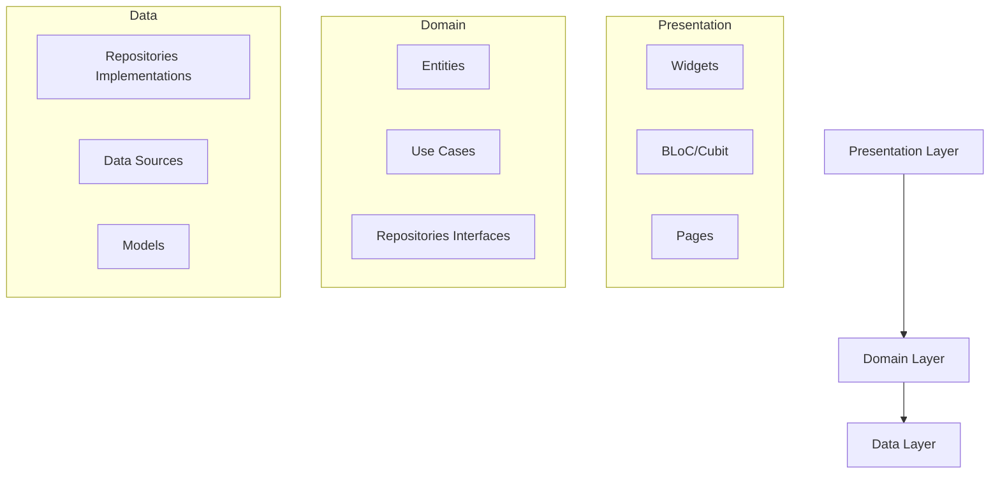

# 🚀 Guia do Multiverso - Rick and Morty

<div align="center">


Uma aplicação Flutter que consome a API do Rick and Morty.

</div>

## 📱 Preview

<div align="center">

https://github.com/user-attachments/assets/80188c99-61d2-49ae-b431-c002d2aa7bac

</div>

## 🎯 Funcionalidades

### ✅ **Requisitos Implementados**

#### **Tela de Listagem (Home)**

- ✅ **Carregamento Inicial**: Busca os primeiros 20 personagens da API
- ✅ **Paginação Infinita**: Scroll infinito com carregamento automático
- ✅ **Cards de Personagem**: Exibe foto, nome, status e localização
- ✅ **Filtros Rápidos**: Chips para filtrar por status (Todos, Vivo, Morto, Desconhecido)
- ✅ **Navegação**: Toque no card navega para detalhes

#### **Tela de Detalhes**

- ✅ **Foto em Destaque**: Banner com imagem do personagem
- ✅ **Status Badge**: Faixa clara com indicador de status
- ✅ **Informações Organizadas**: Seções para gênero, espécie, origem, localização e episódios
- ✅ **Navegação**: Botão de voltar à listagem

#### **Funcionalidades Gerais**

- ✅ **Estados de Loading**: Feedback visual durante carregamentos
- ✅ **Tratamento de Erros**: Mensagens amigáveis e opção de retry
- ✅ **Busca por Nome**: Funcionalidade adicional de busca em tempo real

### ⭐ **Bônus Implementados**

- ✅ **Testes Unitários**: Cobertura completa de BLoC, Repository, DataSource e Widgets
- ✅ **Animações Hero**: Transição suave da imagem entre lista e detalhes
- ✅ **Performance Otimizada**: Cache de imagens e lista com 60fps

## 🏗️ Arquitetura e Tecnologias

### **Arquitetura Escolhida: Clean Architecture + BLoC**



### 🤔 Justificativa de escolhas Técnincas

Utilizar **Bloc** com **Clean Architeture** Trazem uma série de vantagens como maior testabilidade, maior manutenibilidade
e escalabilidade, já que graças ao clean architeture nós conseguimos separar o código em camadas o que facilita os testes, e a escrita do código
e com relação ao BLoc ele foi escolhido por ser o padrão oficial do time do flutter o que faz com que tenha muito material sobre caso precise utiliza-lo para algo mais complexo, e também por ser mantido pelo time do flutter e ser de fácil compreensão

## 🚀 Como Executar o Projeto

### **Pré-requisitos**

- Flutter SDK 3.13.0 ou superior
- Dart 3.0.0 ou superior
- Dispositivo/Emulador Android/iOS

### **📥 Instalação e Execução**

```bash
# 1. Clone o repositório
git clone https://github.com/PuenteVinicius/multiverse_guide
cd guia-multiverso

# 2. Instale as dependências
flutter pub get

# 3. Execute o projeto
flutter run

# 4. (Opcional) Para executar em dispositivo específico
flutter run -d "Nome do Dispositivo"
```

### **🧪 Executando os Testes**

```bash
# Executar todos os testes
flutter test

# Executar testes com cobertura
flutter test --coverage

```
