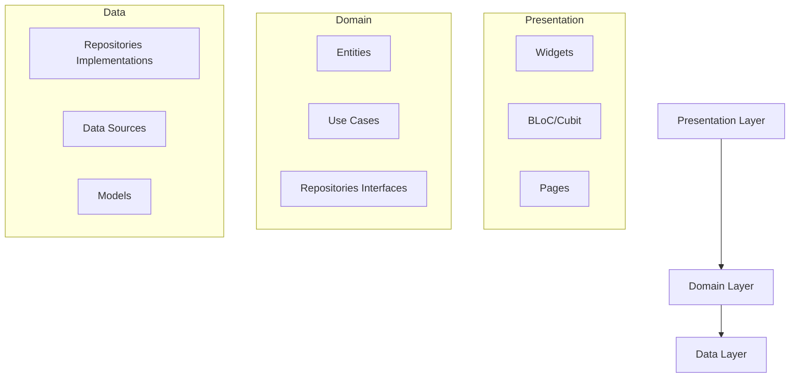

# 🚀 Guia do Multiverso - Rick and Morty

<div align="center">


Uma aplicação Flutter que consome a API do Rick and Morty.

</div>

## 📱 Preview

<div align="center">


https://github.com/user-attachments/assets/80188c99-61d2-49ae-b431-c002d2aa7bac


</div>

## 🎯 Funcionalidades

### ✅ **Requisitos Implementados**

#### **Tela de Listagem (Home)**

- ✅ **Carregamento Inicial**: Busca os primeiros 20 personagens da API
- ✅ **Paginação Infinita**: Scroll infinito com carregamento automático
- ✅ **Cards de Personagem**: Exibe foto, nome, status e localização
- ✅ **Filtros Rápidos**: Chips para filtrar por status (Todos, Vivo, Morto, Desconhecido)
- ✅ **Navegação**: Toque no card navega para detalhes

#### **Tela de Detalhes**

- ✅ **Foto em Destaque**: Banner com imagem do personagem
- ✅ **Status Badge**: Faixa clara com indicador de status
- ✅ **Informações Organizadas**: Seções para gênero, espécie, origem, localização e episódios
- ✅ **Navegação**: Botão de voltar à listagem

#### **Funcionalidades Gerais**

- ✅ **Estados de Loading**: Feedback visual durante carregamentos
- ✅ **Tratamento de Erros**: Mensagens amigáveis e opção de retry
- ✅ **Busca por Nome**: Funcionalidade adicional de busca em tempo real

### ⭐ **Bônus Implementados**

- ✅ **Testes Unitários**: Cobertura completa de BLoC, Repository, DataSource e Widgets
- ✅ **Animações Hero**: Transição suave da imagem entre lista e detalhes
- ✅ **Performance Otimizada**: Cache de imagens e lista com 60fps

## 🏗️ Arquitetura e Tecnologias

### **Arquitetura Escolhida: Clean Architecture + BLoC**



### **📚 Stack Tecnológica**

| Camada                      | Tecnologias                                   |
| --------------------------- | --------------------------------------------- |
| **Framework**               | Flutter 3.13.0, Dart 3.0.0                    |
| **Gerenciamento de Estado** | **flutter_bloc** (oficial do Flutter)         |
| **Injeção de Dependência**  | **get_it**                                    |
| **HTTP Client**             | **http** (oficial)                            |
| **Cache de Imagens**        | **cached_network_image**                      |
| **Testes**                  | **flutter_test**, **mocktail**, **bloc_test** |
| **Linting**                 | **flutter_lints**                             |

### **🤔 Por que BLoC + Clean Architecture?**

1. **Seperação de Responsabilidades**: Cada camada tem uma responsabilidade única
2. **Testabilidade**: Fácil de mockar e testar cada componente isoladamente
3. **Manutenibilidade**: Mudanças em uma camada não afetam as outras
4. **Escalabilidade**: Nova features podem ser adicionadas sem refatorar código existente
5. **Padrão Oficial**: BLoC é recomendado e mantido pelo time do Flutter

## 🚀 Como Executar o Projeto

### **Pré-requisitos**

- Flutter SDK 3.13.0 ou superior
- Dart 3.0.0 ou superior
- Dispositivo/Emulador Android/iOS

### **📥 Instalação e Execução**

```bash
# 1. Clone o repositório
git clone https://github.com/seu-usuario/guia-multiverso.git
cd guia-multiverso

# 2. Instale as dependências
flutter pub get

# 3. Execute o projeto
flutter run

# 4. (Opcional) Para executar em dispositivo específico
flutter run -d "Nome do Dispositivo"
```

### **🧪 Executando os Testes**

```bash
# Executar todos os testes
flutter test

# Executar testes com cobertura
flutter test --coverage

# Executar testes específicos
flutter test test/presentation/bloc/character_list_bloc_test.dart
flutter test test/data/repositories/character_repository_impl_test.dart

```
